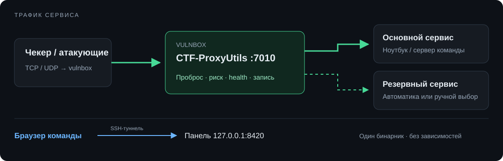

# CTF-ProxyUtils

[](https://github.com/SagDeap/CTF-ProxyUtils/releases/latest)
[](https://github.com/SagDeap/CTF-ProxyUtils/actions/workflows/ci.yml)

TCP-прокси для Attack/Defense CTF: перенести сервис с vulnbox на другую машину,
переключить резерв и разобрать входящий трафик. Один бинарник с веб-панелью,
без внешних зависимостей.



## Запуск

```sh
curl -LO https://github.com/SagDeap/CTF-ProxyUtils/releases/latest/download/ctf-proxyutils-linux-amd64
chmod +x ctf-proxyutils-linux-amd64
./ctf-proxyutils-linux-amd64
```

Ссылка с токеном появится в консоли. Панель по умолчанию: `127.0.0.1:8420`.
Для доступа с ноутбука:

```sh
ssh -L 8420:127.0.0.1:8420 user@vulnbox
```

Открой ссылку в браузере → **Сканер сети** → выбери порт → **пробросить**.
Локальный порт должен быть свободен, а целевая машина — доступна с vulnbox.
Правила и настройки сохраняются в `config.json` рядом с бинарником.

## Возможности

- TCP-пробросы, ACL по IP/CIDR, лимиты соединений и таймауты.
- Основной и резервный адрес. Режимы **авто / основной / резерв**;
  изменение health-check сохраняет текущие соединения.
- Сканер IPv4: открытые порты, баннеры, имена и MAC на Linux.
- Трафик: текст, hex, целый поток; поиск строки, hex или regex,
  фильтры по клиенту, времени и направлению.
- Закрепление соединений и экспорт в JSON. Обычная очистка сохраняет
  закреплённое; если все места закреплены, новые записи пропускаются.
- Журнал последних 200 событий и графики за последние 5 минут.

Трафик, закрепления, журнал и графики хранятся **в памяти до перезапуска**.
Запись ограничена числом соединений и объёмом данных в каждом направлении;
обрезанные записи помечены. Поиск работает по сохранённым байтам.
TLS-трафик остаётся зашифрованным. Health-check проверяет TCP-подключение,
а не корректность ответа приложения; состояние данных между резервами не синхронизируется.

## Параметры

| Флаг | Назначение |
|---|---|
| `-addr IP:8420` | Адрес панели |
| `-bind-all` | Открыть панель на всех интерфейсах |
| `-token TOKEN` | Задать токен |
| `-config PATH` | Другой файл конфигурации |
| `-no-auth` | Отключить авторизацию |
| `-version` | Показать версию |

Панель рекомендуется открывать через SSH-туннель. Токен передаётся в заголовке,
авторизация через cookie не поддерживается. Для портов ниже 1024 на Linux:

```sh
sudo setcap 'cap_net_bind_service=+ep' ./ctf-proxyutils-linux-amd64
```

## Разработка

```sh
go build -o ctf-proxyutils ./cmd/ctf-proxyutils
go test ./...
go test -race ./...       # нужен C-компилятор
go vet ./...
node --test internal/web/static/_traffic-utils.test.js
make dist VERSION=v0.2.0 # Linux/macOS; бинарники и SHA-256 в dist/
```

Релизы собираются Go 1.27 для Linux (amd64, arm64, 386, arm), macOS (amd64,
arm64) и Windows (amd64). [API](docs/api.md) · [MIT](LICENSE)
