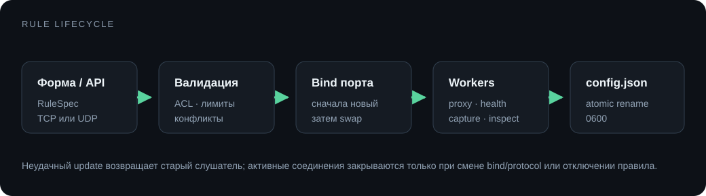

# Начало работы

## 1. Запусти панель

```sh
./ctf-proxyutils-linux-amd64
```

По умолчанию панель доступна только на `127.0.0.1:8420`. Открой её с рабочего компьютера:

```sh
ssh -L 8420:127.0.0.1:8420 user@vulnbox
```

Скопируй токен из консоли. `-bind-all` нужен только когда панель должна слушать внешние интерфейсы.

## 2. Создай проброс

В **Сканере** укажи подсеть, найди сервис и нажми **Пробросить**. Либо задай правило вручную:

- протокол и свободный локальный порт;
- адрес и порт сервиса;
- резервный адрес, если он есть;
- ACL и лимиты;
- запись и анализ трафика.



Новые TCP-соединения получают текущий адрес назначения при подключении. Уже открытые соединения не переносятся при переключении. UDP-клиенты получают отдельные временные сессии.

## 3. Проверь маршрут

Карточка правила показывает состояние слушателя, health-check, текущий маршрут, подключения и байты. В режиме `auto` резерв включается после заданного числа ошибок и отключается после восстановления основного адреса.

## Файлы и память

`config.json` хранит правила, настройки сканера, детекторы и токен. Запись выполняется атомарно, права файла на Unix — `0600`.

Дампы трафика, находки, события и графики хранятся в памяти. Ограничения задаются на правило; закреплённые записи не вытесняются обычной очисткой.

## Обновление

Останови процесс, замени бинарник и запусти его с тем же `config.json`. Конфигурации v0.x мигрируют автоматически: старые правила считаются TCP-правилами, а новые поля получают безопасные значения по умолчанию.
