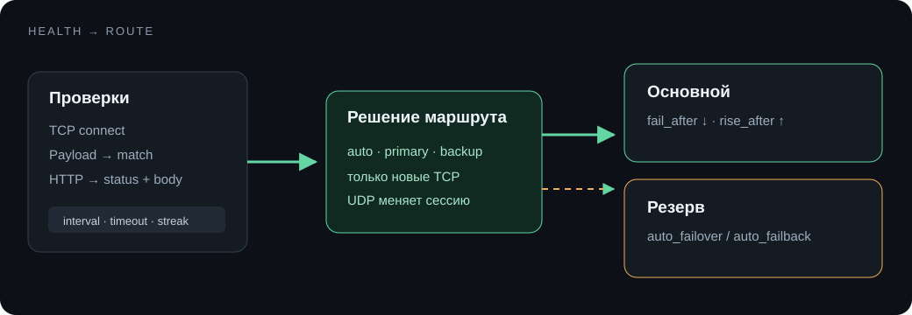

# Health-check и failover

Проверка выполняется отдельно для основного и резервного адреса. После `fail_after` ошибок адрес считается недоступным; после `rise_after` успехов — восстановленным.



## Режимы проверки

| Режим | Проверка |
|---|---|
| `tcp` | подключение к TCP-порту |
| `payload` | TCP/UDP-подключение, необязательный text/hex запрос и ожидаемый text/hex/regex ответ |
| `http` | HTTP-метод, путь, Host, заголовки, body, статус и шаблон тела ответа |

`payload` подходит для приветствия сервиса, простого challenge-response и UDP-протоколов. Для UDP обязательны и запрос, и ожидаемый ответ: обычный `connect` не подтверждает доступность UDP-сервиса. Чтение ограничено 64 КиБ и таймаутом проверки.

HTTP-пример:

```text
GET /healthz
Host: service.internal
X-Health-Check: ctf-proxy
ожидаемый статус: 204
```

## Маршрутизация

- `auto` — переход на живой резерв и возврат на основной согласно настройкам;
- `primary` — новые соединения всегда идут на основной адрес;
- `backup` — новые соединения всегда идут на резерв.

Изменение health-check не закрывает активные TCP-соединения. Смена цели применяется к новым соединениям; UDP-сессия пересоздаётся, если её цель изменилась.
