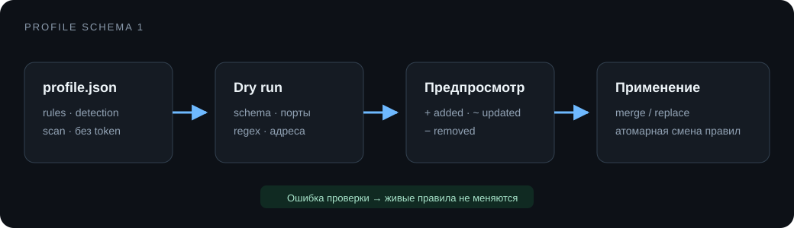

# Профили

Профиль переносит правила, детекторы и настройки сканера между машинами. Токен и адрес панели в экспорт не входят.



## Через панель

Кнопка **Экспорт профиля** скачивает JSON. При импорте панель сначала отправляет `dry_run`, показывает число добавленных и обновлённых правил, затем применяет профиль после подтверждения.

Панель использует `merge`:

- совпавший ID правила обновляется;
- новый ID добавляется;
- остальные локальные правила сохраняются.

API также поддерживает `replace`, который полностью заменяет набор правил.

## Формат

```json
{
  "schema_version": 1,
  "name": "vulnbox-1",
  "scan": {},
  "detection": {},
  "rules": []
}
```

Перед применением проверяются версия схемы, детекторы, адреса, конфликты портов и полный набор правил. `dry_run` не меняет слушатели и конфигурацию.

Профиль может содержать адреса внутренней сети и шаблоны флагов. Проверь файл перед публикацией, даже несмотря на отсутствие токена панели.
