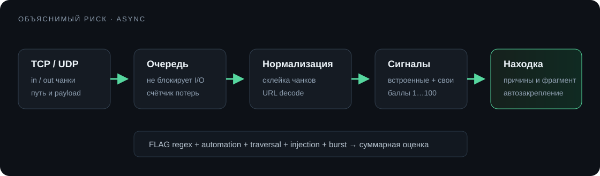

# Анализ трафика

Инспекция работает асинхронно и не задерживает передачу байтов. Для каждого соединения движок держит ограниченный буфер, суммирует независимые сигналы и создаёт находку после порога `threshold`.



## Встроенные сигналы

| Сигнал | Что ищет | Баллы |
|---|---|---:|
| Автоматизированный HTTP-клиент | `python-requests`, `aiohttp`, `httpx`, `curl`, `Go-http-client`, `Wget` в User-Agent | 45 |
| Path traversal | `../`, URL-encoded варианты, `/etc/passwd`, `/proc/self/` | 35 |
| Injection | характерные shell/SQL/eval/exec последовательности | 40 |
| Всплеск соединений | 20 соединений одного клиента за 10 секунд | 25 |

URL-encoded данные проверяются также в декодированном виде. Находка показывает каждый сработавший сигнал, направление, фрагмент и итоговую оценку. Оценка ограничена 100.

## Свои детекторы

Детектор задаёт:

- шаблон `text`, `hex` или RE2 `regex`;
- направление `in`, `out` или `any`;
- область `stream`, `http_headers`, `http_path` или `http_body`;
- баллы, регистр и список ID правил;
- `sensitive`, чтобы не показывать найденный флаг или секрет.

Пример regex флага:

```text
FLAG\{[A-Za-z0-9_-]{16,64}\}
```

Для флага обычно ставят 80–100 баллов и включают `sensitive`. Для слабой эвристики лучше 10–30: несколько разных сигналов тогда складываются в объяснимый риск.

## Ограничения

- Инспекция видит сетевой поток, но не расшифровывает TLS.
- HTTP-области рассчитаны на обычный HTTP/1.x. Для произвольного бинарного протокола используй `stream`.
- Каждый детектор добавляет баллы не более одного раза на соединение.
- При перегрузке очередь не блокирует прокси; число пропущенных событий видно в разделе **Риски**.
