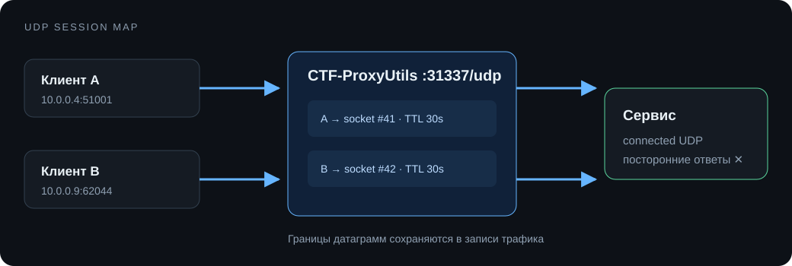

# UDP-пробросы

UDP не имеет соединений, поэтому прокси создаёт сессию по адресу клиента `IP:port`. Сессия использует отдельный подключённый upstream-сокет и принимает ответы только от выбранного сервиса.

`udp_idle_sec` задаёт время жизни после последнего пакета. Истёкшая сессия закрывается; следующий пакет создаёт новую и выбирает актуальный основной или резервный адрес.

Для UDP доступны:

- ACL и предел одновременных клиентских сессий;
- запись отдельных датаграмм без склеивания границ;
- анализ входящих и исходящих payload;
- TCP-подобная статистика байтов, ошибок и активных сессий;
- health-check `payload` с запросом и ожидаемым ответом. Проверка подключения и HTTP для UDP запрещены: создание UDP-сокета само по себе не доказывает доступность сервиса.

Большие датаграммы читаются буфером 64 КиБ. Прокси не восстанавливает фрагменты и не гарантирует доставку поверх самого UDP.
